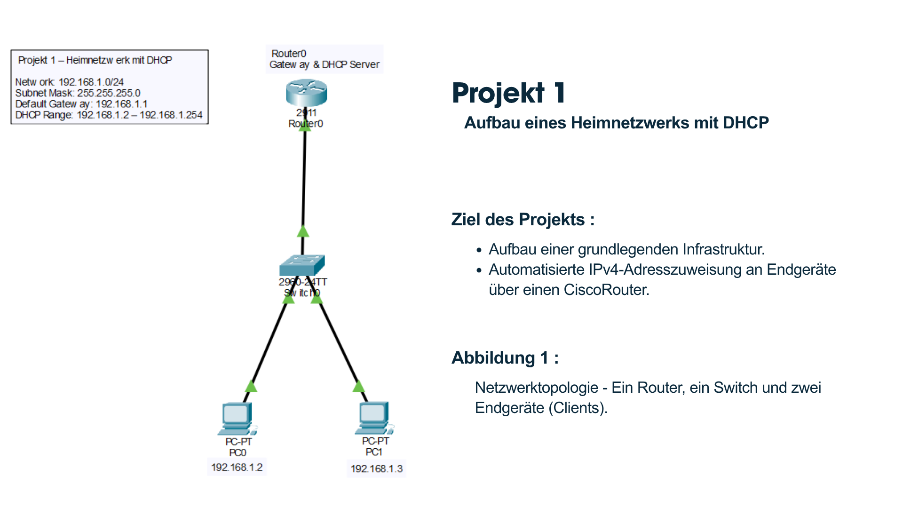
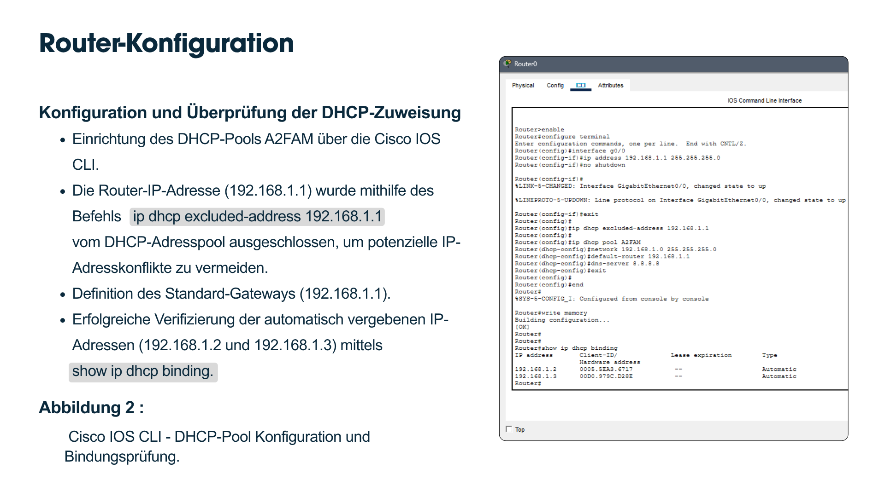
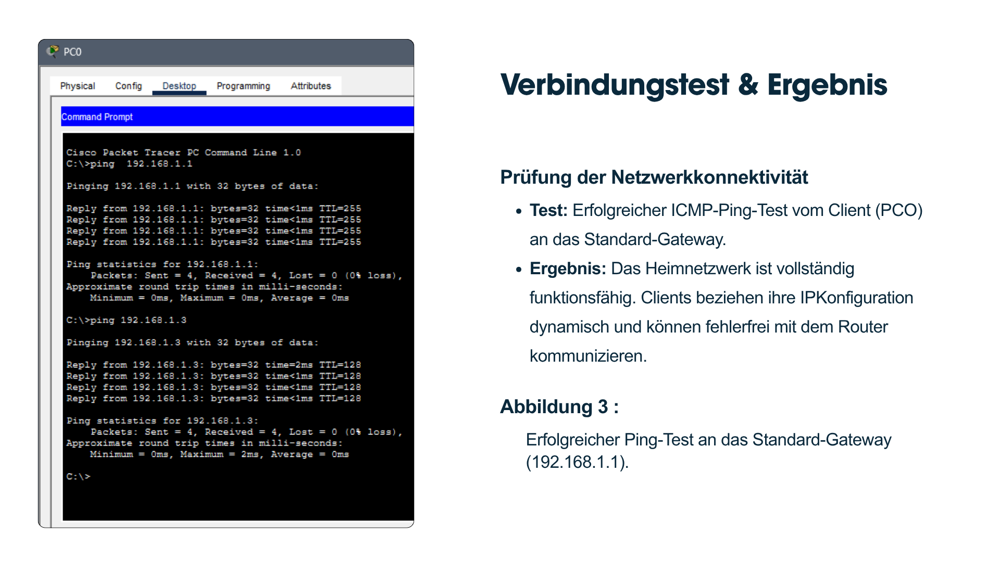

# Home Network with DHCP

## Overview

This project demonstrates a small home network created in Cisco Packet Tracer.

The router is configured as a DHCP server to automatically assign IPv4 addresses to connected devices.

## Objectives

- Configure a home network
- Configure DHCP on a Cisco router
- Assign IP addresses automatically
- Test network connectivity

## Network Topology

```
        Internet
            |
        Cisco Router
            |
         Switch
        /      \
     PC1        PC2
```

## Technologies

- Cisco Packet Tracer
- Cisco IOS
- DHCP
- IPv4
- LAN

## Configuration

- Router configured as DHCP Server
- Automatic IP Assignment
- Default Gateway
- DNS Configuration

## Verification

- PCs receive IP addresses automatically
- Successful ping between all devices

## Skills

- DHCP Configuration
- IPv4 Addressing
- Cisco IOS CLI
- LAN Configuration
- Network Troubleshooting

## Files

- Home-Network-DHCP.pkz
- topology.png
- screenshots/
- ## Screenshots

### Network Topology



---

### Router DHCP Configuration



---

### Connectivity Test


