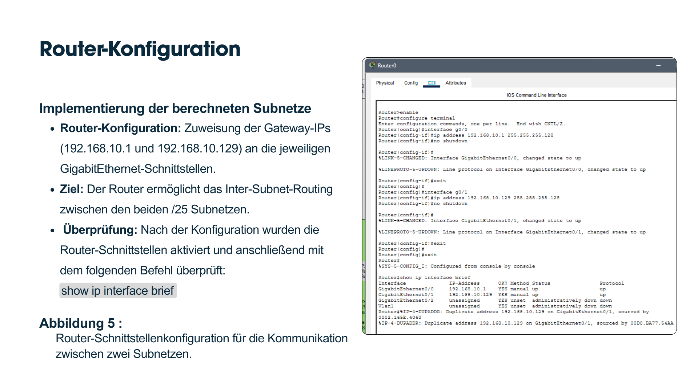

# IPv4 Subnetting

## Overview

This project demonstrates IPv4 subnetting using Cisco Packet Tracer.

A single /24 network is divided into two /25 subnets to improve network organization and reduce broadcast traffic. The project includes router configuration, client addressing, and connectivity verification.

---

## Objectives

- Design IPv4 subnets
- Divide a /24 network into two /25 subnets
- Configure router interfaces
- Assign static IP addresses
- Verify communication between subnets

---

## Technologies

- Cisco Packet Tracer
- Cisco IOS CLI
- IPv4
- Subnetting
- ICMP

---

## Network Information

### Subnet 1

- Network: 192.168.10.0/25
- Gateway: 192.168.10.1
- Host Range: 192.168.10.2 - 192.168.10.126
- Broadcast: 192.168.10.127

### Subnet 2

- Network: 192.168.10.128/25
- Gateway: 192.168.10.129
- Host Range: 192.168.10.130 - 192.168.10.254
- Broadcast: 192.168.10.255

---

## Configuration

- Router interface configuration
- IPv4 subnet assignment
- Static IP configuration
- Gateway configuration

---

## Verification

- Successful ping between both subnets
- Correct IP addressing
- Router connectivity verified

---

## Skills

- IPv4 Subnetting
- Cisco IOS CLI
- Router Configuration
- Static IP Addressing
- Network Troubleshooting

---

## Files

- subnetting.pkt
- network-topology.png
- router-configuration.png
- client-configuration.png
- connectivity-test.png

---

## Screenshots

### Network Topology

---

### Router Configuration

---

### Client Configuration

---

### Connectivity Test

---

## What I Learned

- Design IPv4 subnets
- Configure Cisco router interfaces
- Assign static IP addresses
- Verify communication using ICMP
- Build small routed networks using Cisco Packet Tracer
