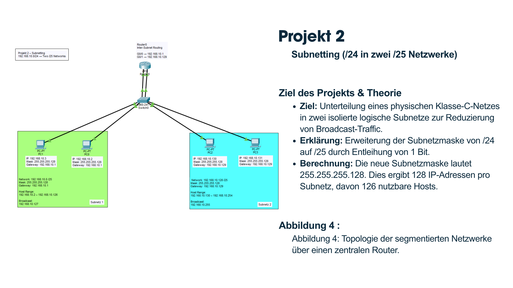
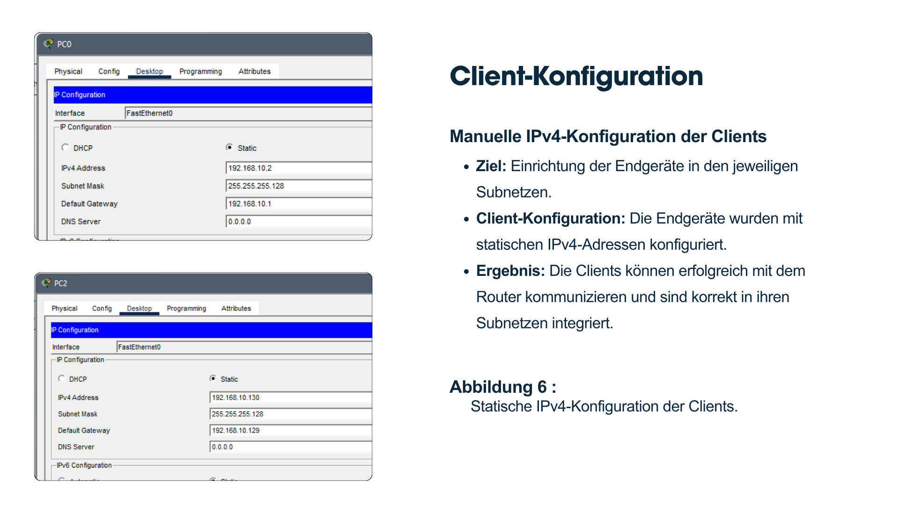
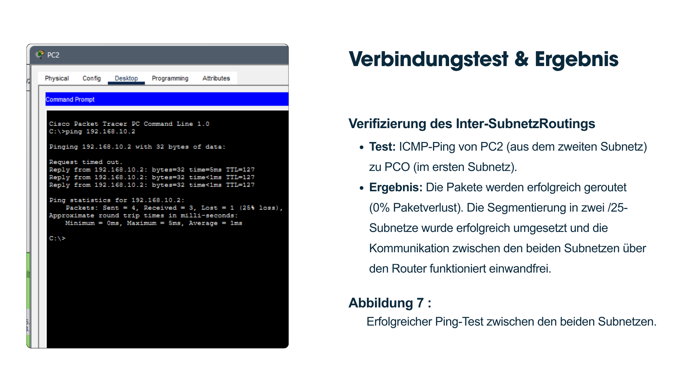

# Subnetting

## Overview

This project demonstrates IPv4 subnetting using Cisco Packet Tracer.

The network is divided into multiple subnets to improve network organization and communication.

## Objectives

- Perform IPv4 subnetting
- Configure router interfaces
- Assign IP addresses
- Verify connectivity

## Technologies

- Cisco Packet Tracer
- Cisco IOS
- IPv4
- Subnetting

## Configuration

- Router Configuration
- IPv4 Addressing
- Subnet Assignment

## Verification

- Successful Ping
- Correct IP Addressing
- Network Connectivity

## Skills

- IPv4 Subnetting
- Cisco IOS CLI
- Router Configuration
- Network Troubleshooting

## Files

- subnetting.pkz
- network-topology.png
- router-configuration.png
- subnetting-results.png

## What I Learned

- Design IPv4 subnets.
- Configure router interfaces.
- Verify network communication.

  ## Screenshots

### Network Topology

---

### Router Configuration

---

### Client Configuration

---

### Connectivity Test

