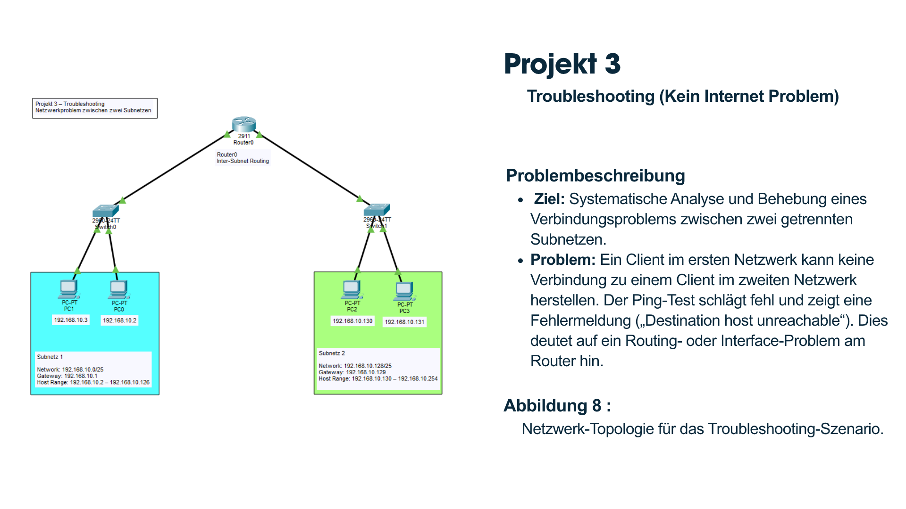
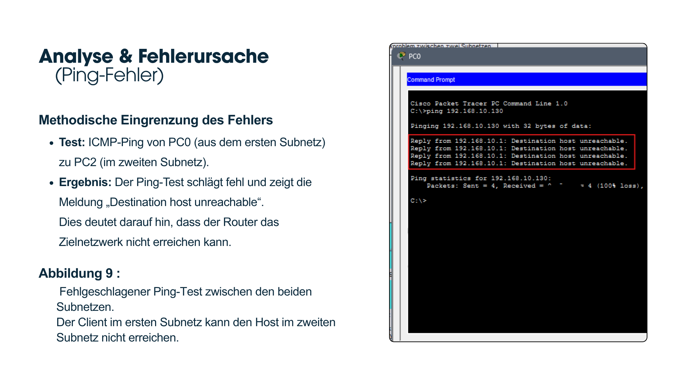
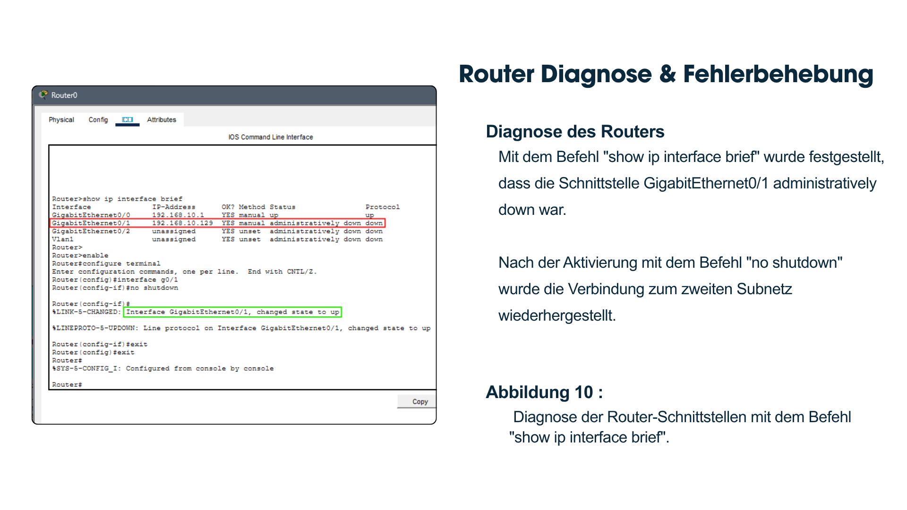
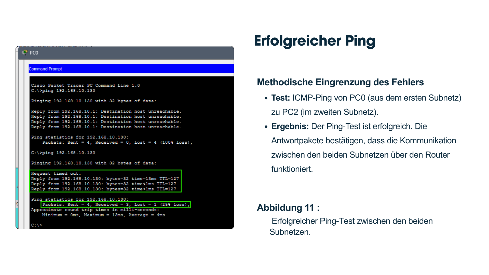

# Network Troubleshooting (Inter-Subnet Connectivity)

## Overview

This project demonstrates troubleshooting a network connectivity issue between two subnets using Cisco Packet Tracer.

A routing problem prevented communication between the networks. The issue was identified, analyzed, and successfully resolved using Cisco IOS troubleshooting commands.

---

## Objectives

- Identify network connectivity problems
- Analyze ICMP ping failures
- Diagnose router interface issues
- Restore communication between two subnets
- Verify successful connectivity

---

## Scenario

Two IPv4 subnets are connected through a Cisco router.

A client in Subnet 1 cannot communicate with a client in Subnet 2 because one router interface is administratively down.

---

## Technologies

- Cisco Packet Tracer
- Cisco IOS CLI
- IPv4
- Static Routing
- ICMP
- Network Troubleshooting

---

## Troubleshooting Steps

- Test connectivity using Ping
- Analyze error messages
- Check router interfaces
- Use **show ip interface brief**
- Enable the disabled interface
- Verify successful communication

---

## Skills

- Network Troubleshooting
- Cisco IOS CLI
- Router Diagnostics
- Interface Configuration
- ICMP Testing
- Problem Solving

---

## Files

- troubleshooting.pkt
- network-topology.png
- ping-failed.png
- router-diagnosis.png
- successful-ping.png

---

# Screenshots

## Network Topology

---

## Ping Failure

---

## Router Diagnosis

---

## Successful Ping

---

## What I Learned

- Troubleshoot Cisco networks systematically.
- Diagnose router interface problems.
- Restore network connectivity.
- Verify communication using ICMP.
- Use Cisco IOS commands to resolve connectivity issues.
