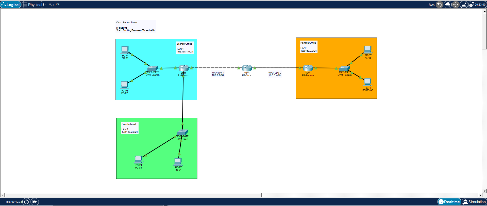
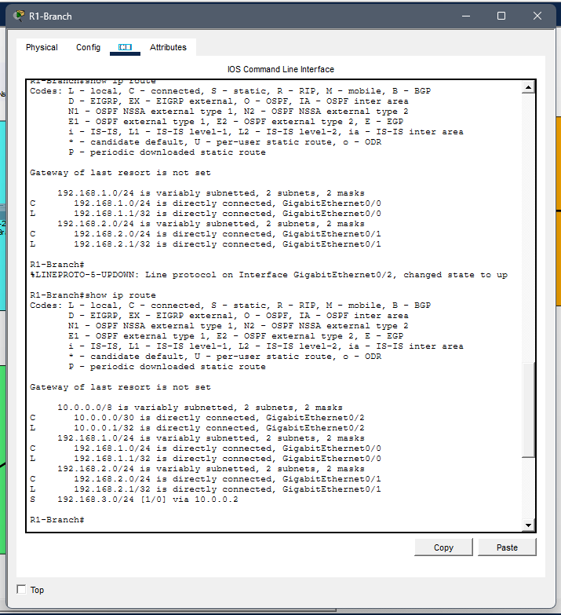
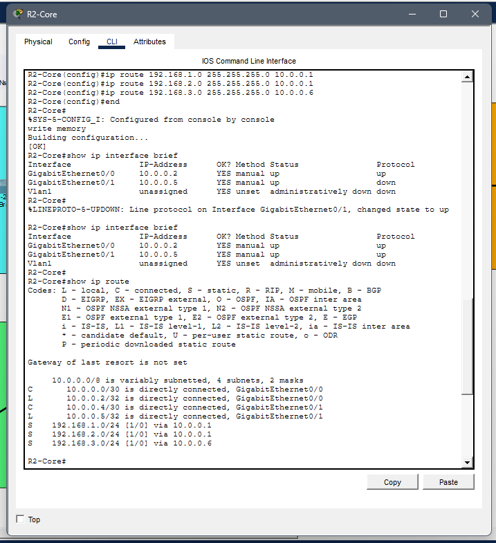
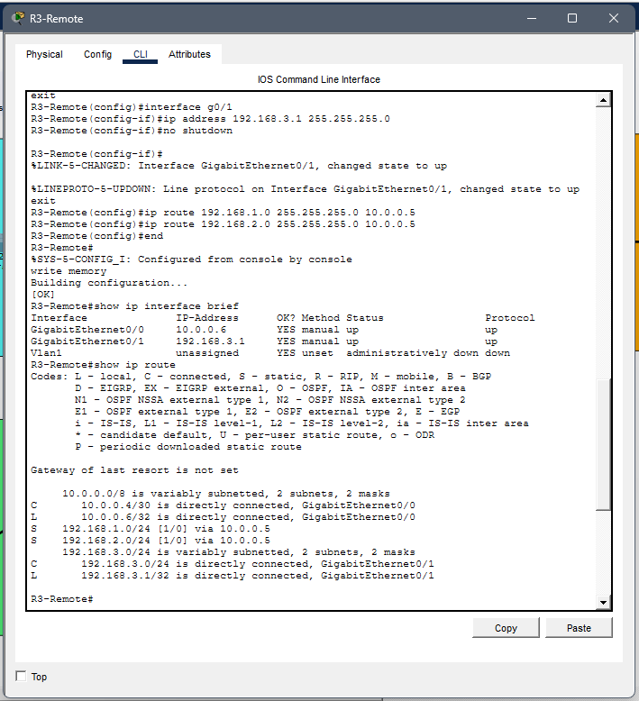
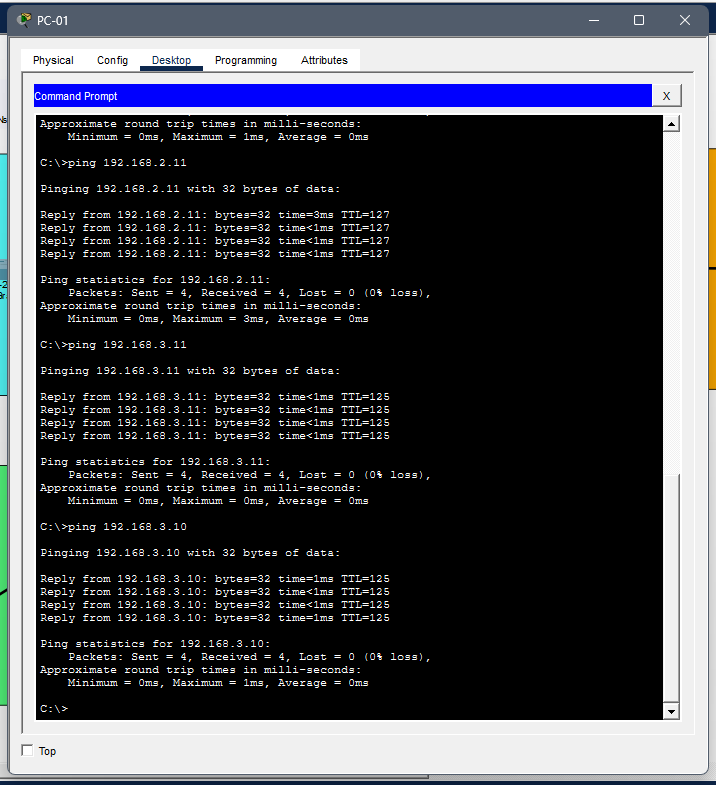
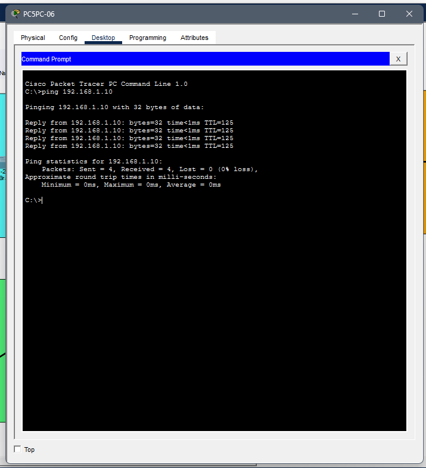

# Static Routing Between Multiple Sites

## Overview

This project demonstrates how to configure static routing between multiple LANs connected through Cisco routers using Cisco Packet Tracer.

Three different office networks communicate through two WAN point-to-point links using manually configured static routes.

---

## Objectives

- Configure static routes on Cisco routers
- Connect multiple LANs through WAN links
- Verify routing tables
- Test end-to-end connectivity
- Understand next-hop routing

---

## Scenario

The network consists of three different locations:

- Branch Office (LAN 1)
- Core Network (LAN 2)
- Remote Office (LAN 3)

Each site is connected through point-to-point WAN links.

Static routes are configured manually on every router to allow communication between all networks.

---

## Technologies

- Cisco Packet Tracer
- Cisco IOS
- IPv4
- Static Routing
- WAN Point-to-Point Links
- ICMP

---

## IP Addressing

| Network | Address |
|---------|---------|
| LAN 1 | 192.168.1.0/24 |
| LAN 2 | 192.168.2.0/24 |
| LAN 3 | 192.168.3.0/24 |
| WAN Link 1 | 10.0.0.0/30 |
| WAN Link 2 | 10.0.0.4/30 |

---

## Router Configuration

### Branch Router

- Connected to LAN 1
- Connected to LAN 2
- Static route to LAN 3

### Core Router

- Connects Branch and Remote routers
- Static routes to all LAN networks

### Remote Router

- Connected to LAN 3
- Static routes to LAN 1 and LAN 2

---

## Verification

The following commands were used:

```text
show ip interface brief

show ip route

ping
```

---

## Skills

- Static Routing
- Cisco IOS CLI
- Routing Tables
- WAN Configuration
- IPv4 Addressing
- Point-to-Point Networks
- Network Troubleshooting
- ICMP Testing

---

## Files

- static-routing.pkt
- network-topology.png
- r1-routing-table.png
- r2-routing-table.png
- r3-routing-table.png
- ping-test-branch.png
- ping-test-remote.png

---

# Screenshots

## Network Topology



---

## Branch Router Routing Table



---

## Core Router Routing Table



---

## Remote Router Routing Table



---

## Successful Ping (Branch)



---

## Successful Ping (Remote)



---

## What I Learned

- Configure static routing between multiple routers.
- Build a multi-site routed network.
- Configure WAN point-to-point connections.
- Verify routing tables using Cisco IOS.
- Troubleshoot routing issues.
- Test end-to-end communication using ICMP.
