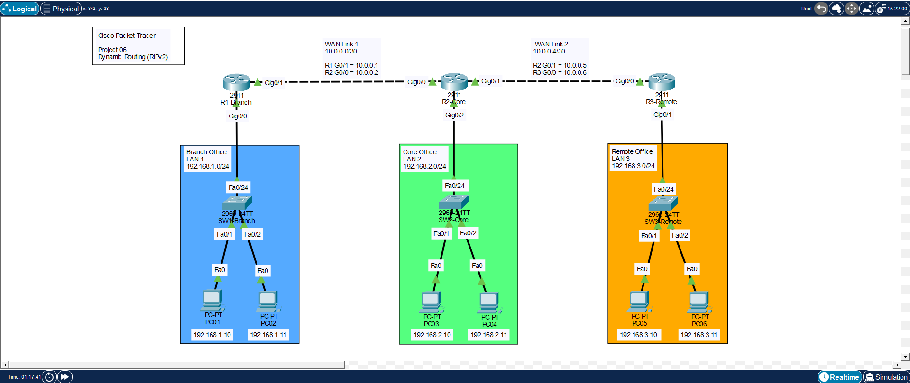
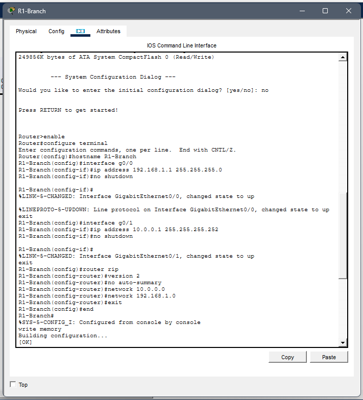
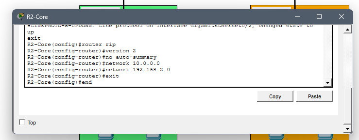
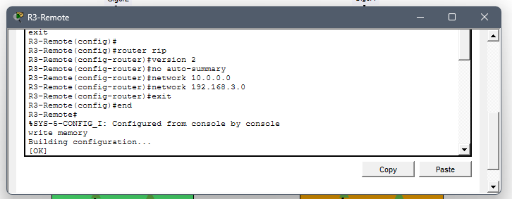
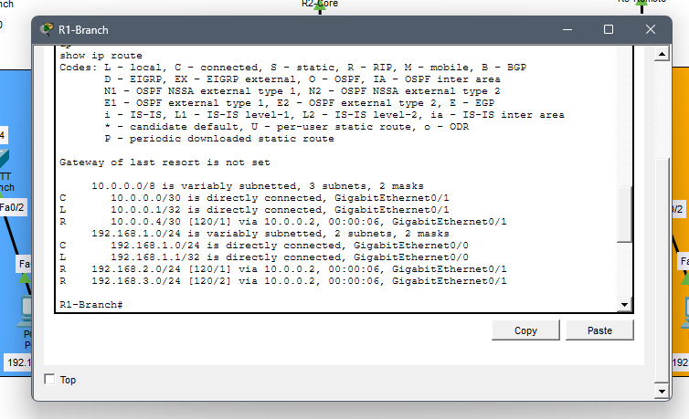
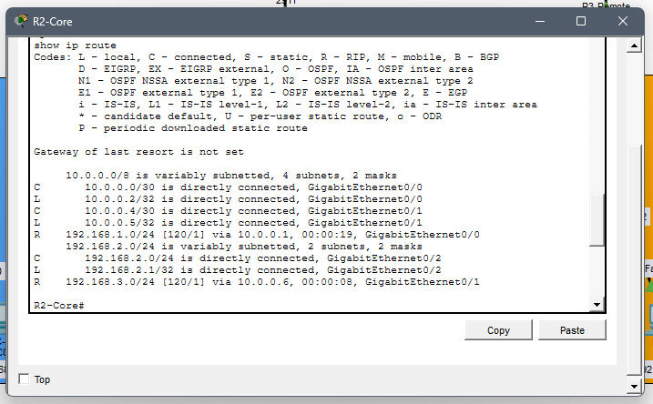
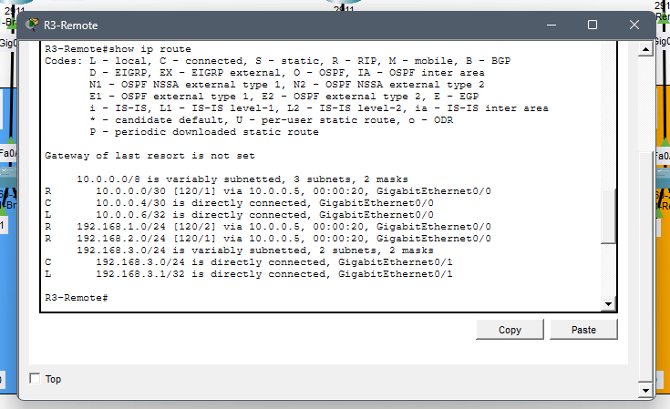
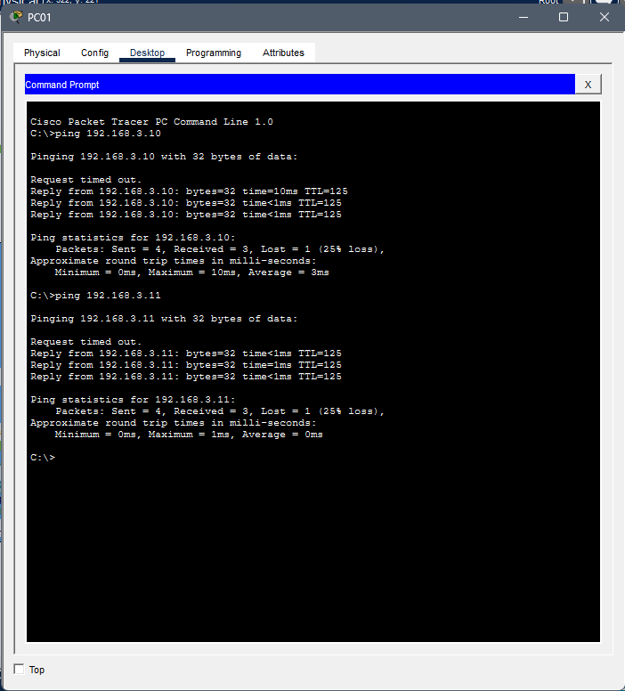
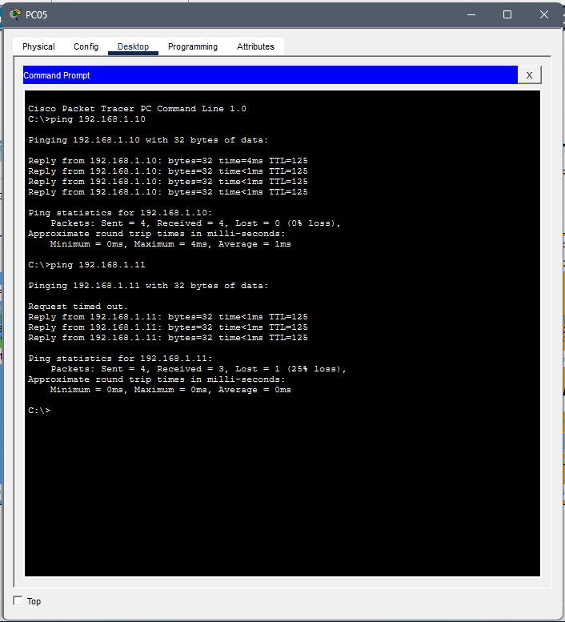

# Dynamic Routing with RIPv2

## Overview

This project demonstrates dynamic routing using **RIP Version 2 (RIPv2)** in Cisco Packet Tracer.

Three different LANs are connected through three Cisco routers. Instead of configuring static routes manually, RIPv2 automatically exchanges routing information between routers.

---

## Objectives

- Configure dynamic routing using RIPv2
- Connect three remote LANs
- Exchange routing information automatically
- Verify routing tables
- Test end-to-end connectivity

---

## Technologies

- Cisco Packet Tracer
- Cisco IOS CLI
- IPv4
- RIPv2
- Dynamic Routing
- ICMP

---

## Network Topology



---

## Network Addressing

| Network | Address |
|---------|---------|
| LAN 1 | 192.168.1.0/24 |
| LAN 2 | 192.168.2.0/24 |
| LAN 3 | 192.168.3.0/24 |
| WAN Link 1 | 10.0.0.0/30 |
| WAN Link 2 | 10.0.0.4/30 |

---

## RIP Configuration

### Router R1



R1 advertises:

- 192.168.1.0/24
- 10.0.0.0/30

---

### Router R2



R2 advertises:

- 192.168.2.0/24
- 10.0.0.0/30
- 10.0.0.4/30

---

### Router R3



R3 advertises:

- 192.168.3.0/24
- 10.0.0.4/30

---

## Routing Tables

### R1



---

### R2



---

### R3



---

## Connectivity Test

### Branch to Remote



Successful communication from **LAN 1** to **LAN 3** confirms that dynamic routes are working correctly.

---

### Remote to Branch



Successful communication from **LAN 3** back to **LAN 1** verifies bidirectional connectivity.

---

## What I Learned

- Configure RIP Version 2.
- Enable automatic route advertisement.
- Verify routing tables using **show ip route**.
- Verify RIP neighbors and learned routes.
- Troubleshoot routing issues.
- Test network connectivity using ICMP.

---

## Files

```
06 Dynamic Routing with RIPv2/
│── README.md
│── network-topology.png
│── rip-config-r1.png
│── rip-config-r2.png
│── rip-config-r3.png
│── routing-table-r1.png
│── routing-table-r2.png
│── routing-table-r3.png
│── branch-to-remote-ping.png
│── remote-to-branch-ping.png
│── dynamic-routing-ripv2.pkt
```

---

## Skills

- Dynamic Routing
- RIP Version 2
- Cisco IOS
- IPv4 Routing
- Route Advertisement
- Routing Tables
- Cisco Packet Tracer
- Network Troubleshooting
