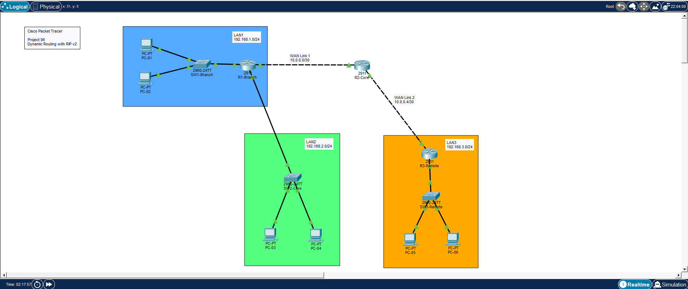
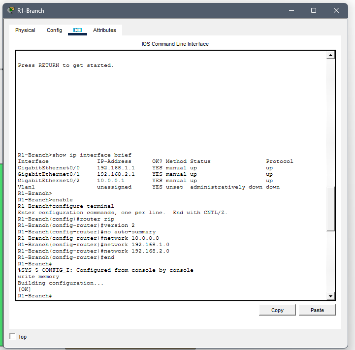
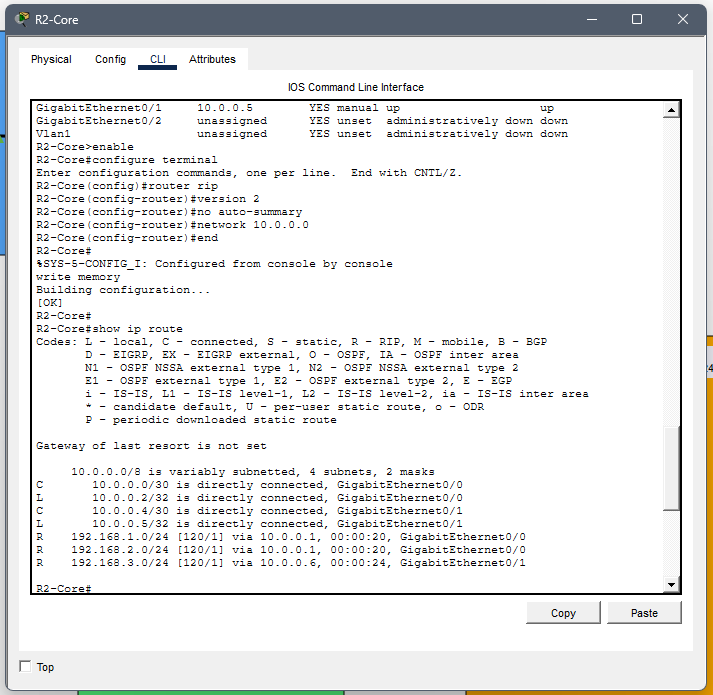
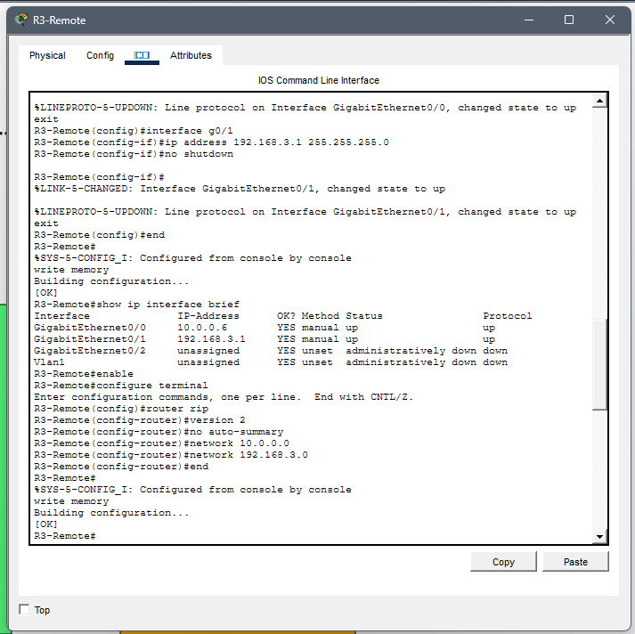
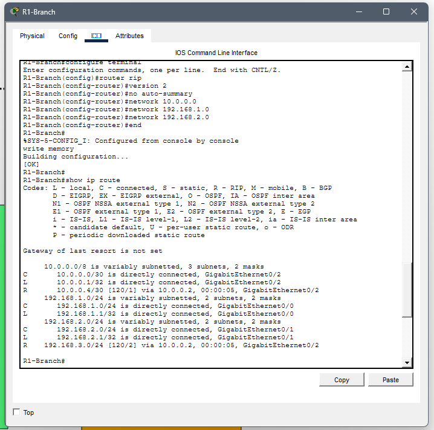
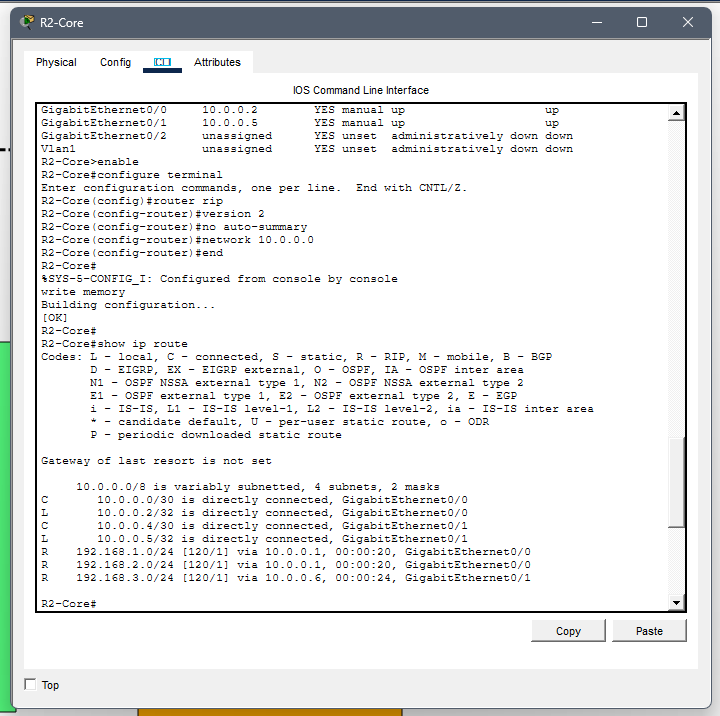
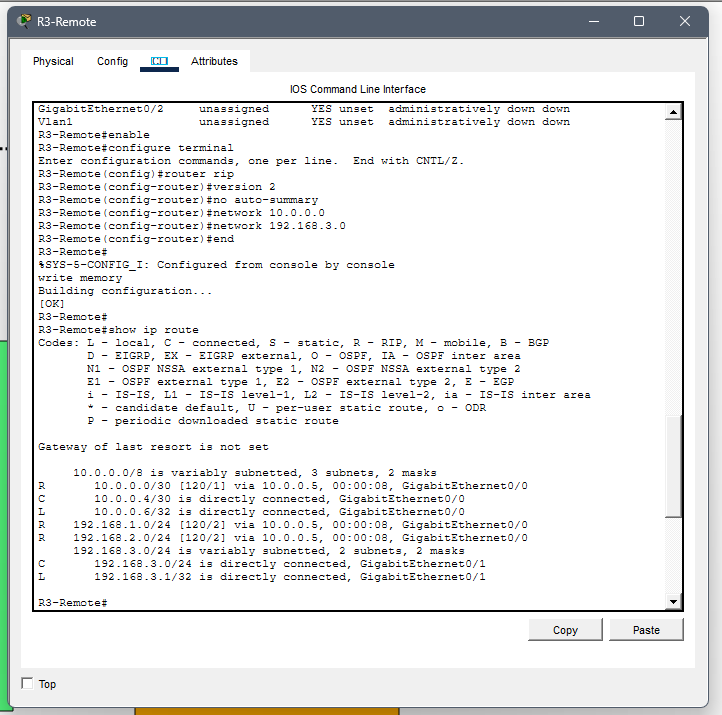
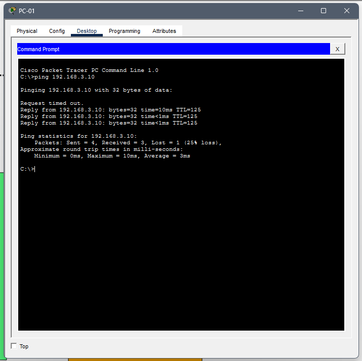
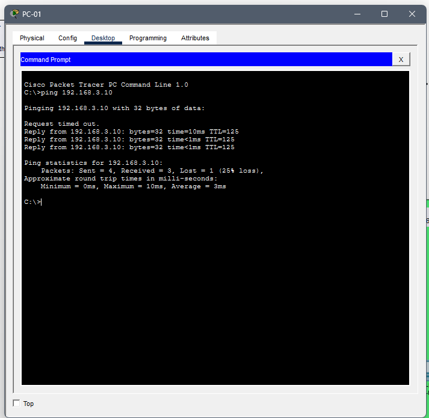

# Dynamic Routing with RIPv2

## Overview

This project demonstrates dynamic routing using RIP version 2 (RIPv2) in Cisco Packet Tracer.

Three different LANs are connected through multiple routers. RIPv2 automatically exchanges routing information, allowing all networks to communicate without manually configuring static routes.

---

## Objectives

- Configure dynamic routing using RIPv2
- Advertise IPv4 networks
- Disable automatic summarization
- Verify routing tables
- Test end-to-end connectivity

---

## Scenario

The network consists of three office locations connected through two WAN point-to-point links.

Instead of configuring static routes, Cisco RIPv2 is used to automatically exchange routing information between routers.

---

## Technologies

- Cisco Packet Tracer
- Cisco IOS
- IPv4
- Dynamic Routing
- RIPv2
- ICMP

---

## IP Addressing

| Network | Address |
|---------|---------|
| LAN 1 | 192.168.1.0/24 |
| LAN 2 | 192.168.2.0/24 |
| LAN 3 | 192.168.3.0/24 |
| WAN Link 1 | 10.0.0.0/30 |
| WAN Link 2 | 10.0.0.4/30 |

---

## Router Configuration

### R1

- Configure RIPv2
- Advertise LAN 1
- Advertise LAN 2
- Advertise WAN network

### R2

- Configure RIPv2
- Advertise both WAN networks

### R3

- Configure RIPv2
- Advertise LAN 3
- Advertise WAN network

---

## Verification

The following commands were used:

```text
show ip protocols

show ip route

show ip interface brief

ping
```

---

## Skills

- Dynamic Routing
- RIP Version 2
- Cisco IOS CLI
- Routing Tables
- IPv4 Addressing
- WAN Configuration
- ICMP Testing
- Network Troubleshooting

---

## Files

- rip-routing.pkt
- network-topology.png
- rip-configuration-r1.png
- rip-configuration-r2.png
- rip-configuration-r3.png
- show-ip-route-r1.png
- show-ip-route-r2.png
- show-ip-route-r3.png
- branch-to-remote-ping.png
- remote-to-branch-ping.png

---

# Screenshots

## Network Topology



---

## R1 RIP Configuration



---

## R2 RIP Configuration



---

## R3 RIP Configuration



---

## Routing Table (R1)



---

## Routing Table (R2)



---

## Routing Table (R3)



---

## Branch to Remote Connectivity



---

## Remote to Branch Connectivity



---

## What I Learned

- Configure dynamic routing using RIPv2.
- Exchange routing information automatically.
- Verify learned routes using Cisco IOS.
- Understand the difference between static and dynamic routing.
- Test end-to-end communication across multiple networks.
- Troubleshoot routing using RIP verification commands.
