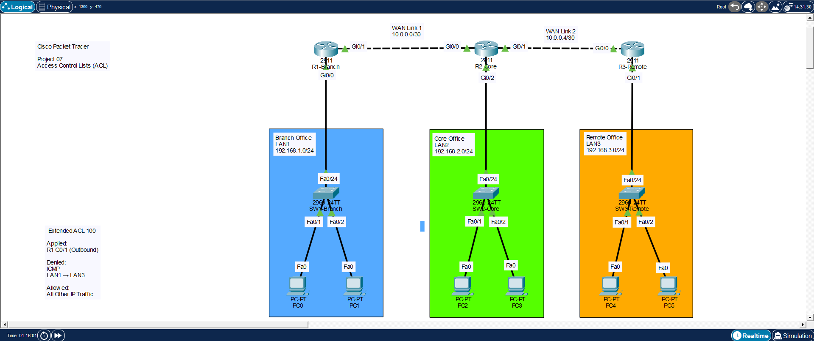
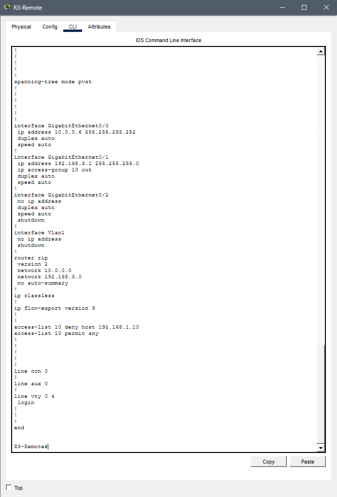
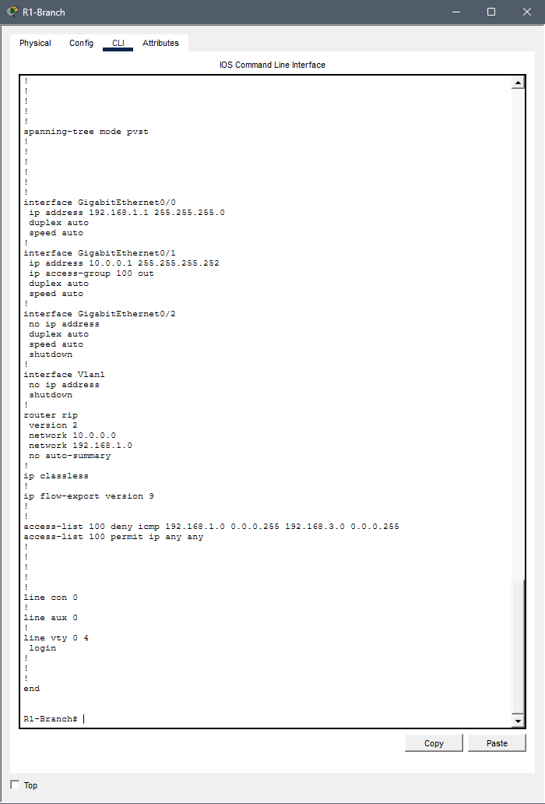
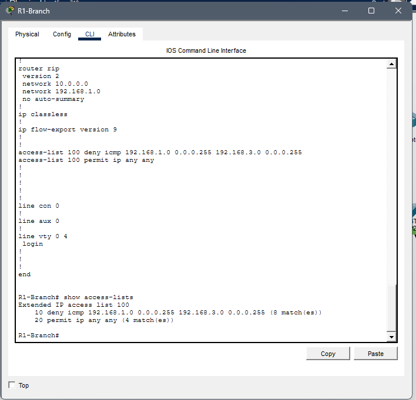
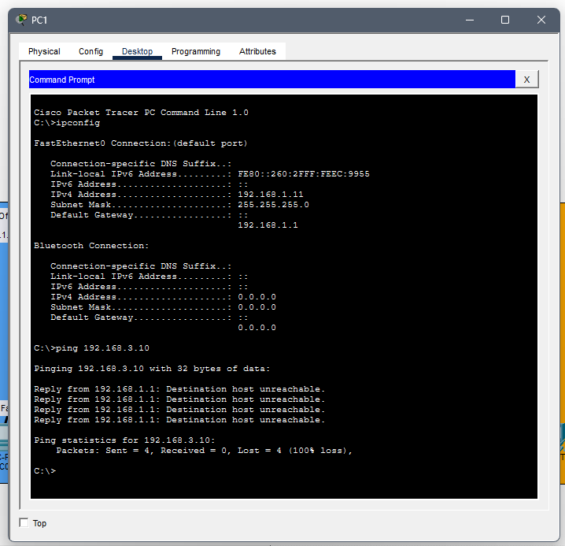
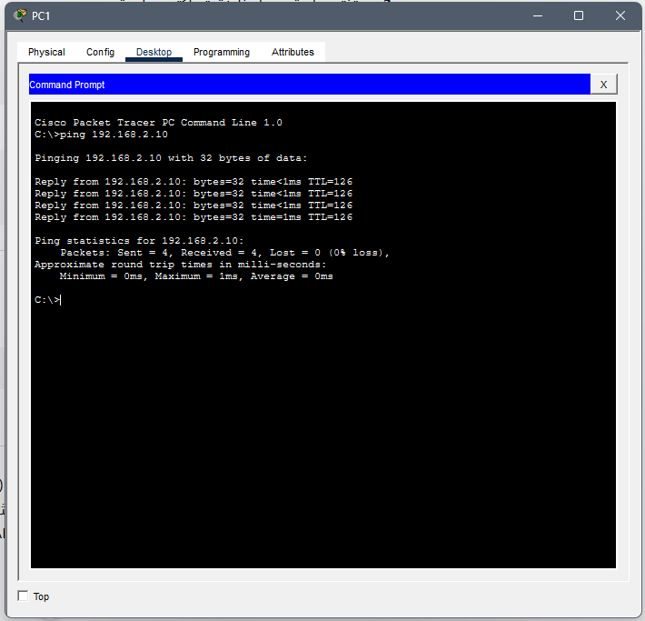

# Access Control Lists (ACL)

## Overview

This project demonstrates the configuration of **Standard** and **Extended Access Control Lists (ACLs)** using Cisco Packet Tracer.

ACLs are used to control network traffic by permitting or denying packets based on source addresses, destination addresses, and protocols.

---

## Objectives

- Configure Standard ACLs
- Configure Extended ACLs
- Control network access
- Verify ACL operation
- Test permitted and denied traffic

---

## Technologies

- Cisco Packet Tracer
- Cisco IOS CLI
- IPv4
- Standard ACL
- Extended ACL
- ICMP
- Network Security

---

## Network Topology



---

## Standard ACL Configuration



### Purpose

The Standard ACL filters traffic based on the **source IP address**.

---

## Standard ACL Verification



This output verifies that the Standard ACL has been configured successfully.

---

## Extended ACL Configuration


### Purpose

The Extended ACL filters traffic based on:

- Source IP Address
- Destination IP Address
- Protocol
- ICMP

This provides more granular traffic control.

---

## Extended ACL Verification



The access-list entries confirm that the Extended ACL is active.

---

## Connectivity Test

### Blocked Traffic



The ping request is denied by the Extended ACL, confirming that the access control policy is working correctly.

---

### Allowed Traffic



The permitted traffic successfully reaches the destination according to the configured ACL rules.

---

## What I Learned

- Configure Standard ACLs
- Configure Extended ACLs
- Apply ACLs to router interfaces
- Verify ACLs using Cisco IOS commands
- Control network access based on security policies
- Troubleshoot ACL configurations
- Test permitted and denied traffic using ICMP

---

## Files

```text
07-Access-Control-Lists-ACL/
│── README.md
│── Project 07.pkt
│── network-topology.png
│── acl-standard-config.png
│── show-access-lists-standard.png
│── acl-extended-config.png
│── show-access-lists-extended.png
│── extended-acl-ping-test.png
│── extended-acl-allowed-ping.png
```

---

## Skills

- Standard ACL
- Extended ACL
- Cisco IOS
- IPv4
- Network Security
- Access Control
- ICMP Testing
- Cisco Packet Tracer
- Network Troubleshooting
